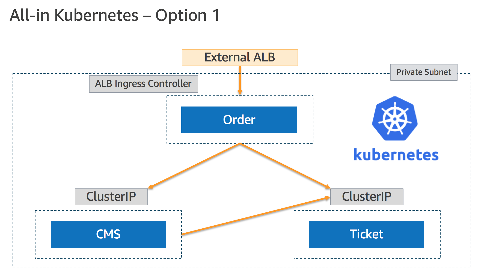
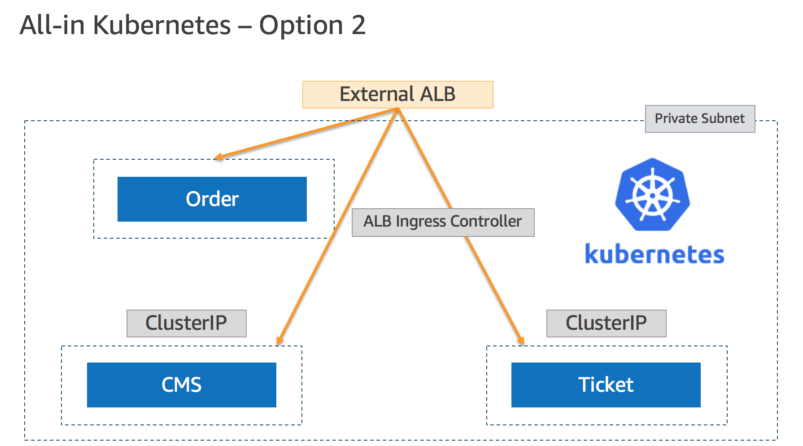
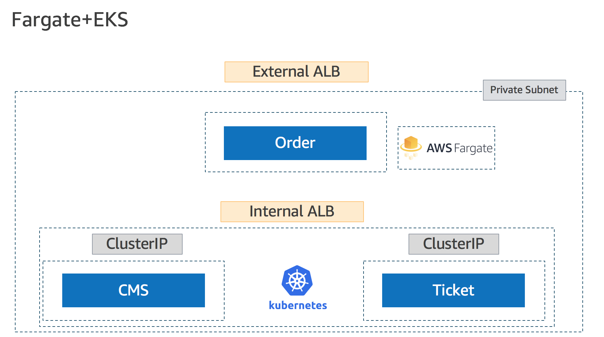

# aws-containers-workshop

This repo aims to help you build a 3-tier e-commerce microservices on **AWS Fargate** and/or **Amazon EKS**.

The architecture containers 3 micro services:

1. **Order** - public-facing API for ticket ordering
2. **Ticket** - order orchistration and processing
3. **CMS** - customer system

## Lab 1 - All-In AWS 

[Start the Lab](lab1/README.md)

## Lab 2 - All-In Amazon EKS

[Start the Lab](lab2/README.md)

