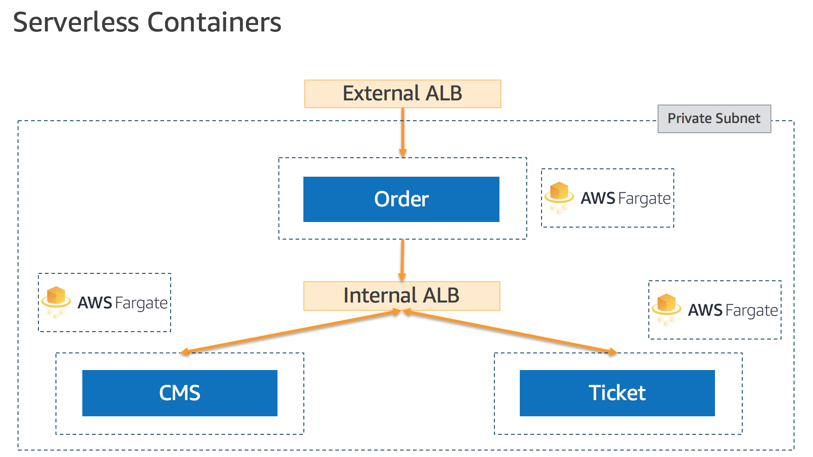

# Lab 1 - Running Services in AWS Fargate




## Create Cloud9 Environment

Open [AWS Cloud9 console](https://ap-northeast-1.console.aws.amazon.com/cloud9) and click **Create Environment** to create your cloud IDE.

## Install Fargate CLI

Install [fargate CLI](https://github.com/jpignata/fargate) from github on your Cloud9 IDE.

check the fargate cli version:

```bash
$ curl https://github.com/jpignata/fargate/releases/download/v0.3.1/fargate-0.3.1-linux-amd64.zip -Lo fargate.zip
$ unzip $_
$ sudo mv fargate /usr/local/bin/
$ fargate --version
fargate version 0.3.0
```
## create the www service

```bash
$ export AWS_REGION=ap-northeast-1
# create external-lb for www service
$ fargate lb create www-lb --port 80
[i] Created load balancer www-lb
# list the lb
$ fargate lb list | grep www-lb
www-lb          Application     Provisioning    www-lb-251274239.ap-northeast-1.elb.amazonaws.com               HTTP:80
# create the www service
$ fargate service create www --lb www-lb --image pahud/aws-container-workshop-service:latest --env SERVICENAME=www --env VERSIONNUM=1.0 --port http:8080
[i] Created service www
# list the services
$ fargate service list
# check the www service info
$ fargate service info www
```
Response
```
Service Name: www
Status: 
  Desired: 1
  Running: 1
  Pending: 0
Image: pahud/aws-container-workshop-service:latest
Cpu: 256
Memory: 512
Subnets: subnet-a7f831ee, subnet-1d040645, subnet-a68ad08e
Security Groups: sg-ca99d4b2
Load Balancer: 
  Name: www-lb
  DNS Name: www-lb-251274239.ap-northeast-1.elb.amazonaws.com
  Ports: 
    HTTP:80: 
      Rules: DEFAULT=
Environment Variables: 
   VERSIONNUM=1.0
   SERVICENAME=www

Tasks
ID                                      IMAGE                                           STATUS  RUNNING IP              CPU     MEMORY  DEPLOYMENT
805109d542a04fc78d2af9650402524b        pahud/aws-container-workshop-service:latest     running 1m14s   18.179.19.76    256     512     7

Deployments
ID      IMAGE                                           STATUS  CREATED                         DESIRED RUNNING PENDING
7       pahud/aws-container-workshop-service:latest     primary 2019-05-27 13:26:29 +0000 UTC   1       1       0

Events
[2019-05-27 13:32:39 +0000 UTC] (service www) has reached a steady state.
[2019-05-27 13:32:17 +0000 UTC] (service www) registered 1 targets in (target-group arn:aws:elasticloadbalancing:ap-northeast-1:903779448426:targetgroup/fargate-www/48f84535518241f1)
[2019-05-27 13:31:42 +0000 UTC] (service www) has started 1 tasks: (task 805109d542a04fc78d2af9650402524b).
```
find the `DNS Name` of the response above and `cURL` on it

```bash
# curl on the www ALB
$ curl http://www-lb-251274239.ap-northeast-1.elb.amazonaws.com
{"service":"www","version":"1.0"}
```

```bash
# create a private LB
$ fargate lb create priv-lb --port http:80 --scheme internal --subnet-id subnet-a7f831ee,subnet-1d040645,subnet-a68ad08e                        
[i] Created load balancer priv-lb
# deploy CMS service
$ fargate service create cms --lb priv-lb -r host=cms.demo.local --image pahud/aws-container-workshop-service:latest --env SERVICENAME=cms --env VERSIONNUM=1.0 --port http:8080     
[i] Created service cms
# create the ticket service
$ fargate service create ticket --lb priv-lb -r host=ticket.demo.local --image pahud/aws-container-workshop-service:latest --env SERVICENAME=ticket --env VERSIONNUM=1.0 --port http:8080
[i] Created service ticket
```

## Create demo.local private hosted zone on Route53

```bash
# craete a private hosted zone "demo.local"
$ aws route53 create-hosted-zone --name demo.local --vpc VPCRegion=ap-northeast-1,VPCId=vpc-497a492d --caller-reference ="$(date)" --hosted-zone-config PrivateZone=true
# Optional - associate to more VPCs in the same region
$ aws route53 associate-vpc-with-hosted-zone  --hosted-zone-id ZY8LKVV17EQE6 --vpc VPCRegion=ap-northeast-1,VPCId=vpc-0e7f406aacc036c4a
```

manually create 2 aliases for `cms.demo.local` and `ticket.demo.local` to the dns name of `priv-lb`. This will make `cms.demo.local` and 
`ticket.demo.local` all resolve to the dns name of `priv-lb`.

Open cloud9 terminal, nslookup `cms.demo.local` and you should be able to see the private IP response.

```bash
$ nslookup cms.demo.local
Server:         10.0.0.2
Address:        10.0.0.2#53

Non-authoritative answer:
Name:   cms.demo.local
Address: 172.31.13.41
Name:   cms.demo.local
Address: 172.31.16.174
```
Try nslookup `ticket.demo.local` now. Same IP address returned as they both alias to the same internal `priv-lb`.
```bash
$ nslookup ticket.demo.local
Server:         10.0.0.2
Address:        10.0.0.2#53

Non-authoritative answer:
Name:   ticket.demo.local
Address: 172.31.16.174
Name:   ticket.demo.local
Address: 172.31.13.41
```


## update the www service

```bash
# destroy the www service
$ fargate service scale www 0
$ fargate service destroy www
# create it again
$ fargate service create www --lb www-lb --image pahud/aws-container-workshop-service:order-latest \
--env SERVICENAME=www \
--env VERSIONNUM=1.0 \
-e PRODUCT_SVC_URL=http://ticket.demo.local \
-e CUSTOMER_SVC_URL=http://cms.demo.local \
--port http:8080
[i] Created service www
```
(please note we are using another dockr image here as this image will send sub-requests to `cms` and `ticket` services)

test the `www` service now

```bash
$ curl -s http://www-lb-251274239.ap-northeast-1.elb.amazonaws.com
{"service":"www", "version":"1.0"}
{"service":"cms","version":"1.0"}
{"service":"ticket","version":"1.0"}
```

# clean up

```bash
# destroy the www service
$ fargate service scale www 0 && fargate service destroy www                                                                                  
[i] Scaled service www to 0
[i] Destroyed service www
# destroy the cms service
$ fargate service scale cms 0 && fargate service destroy cms                                                                                      
[i] Scaled service cms to 0
[i] Destroyed service cms
# destroy the ticket service
$ fargate service scale ticket 0 && fargate service destroy ticket                                                                                
[i] Scaled service ticket to 0
[i] Destroyed service ticket
# destroy the www-lb load balancer
$ fargate lb destroy www-lb
[i] Destroyed load balancer www-lb
# destroy the priv-lb load balancer
$ fargate lb destroy priv-lb
[i] Destroyed load balancer priv-lb
# manual empty all DNS zone sets in demo.local and delete the private hosted zone from Route53
$ aws route53 delete-hosted-zone --id YOUR_ZONE_ID 
```