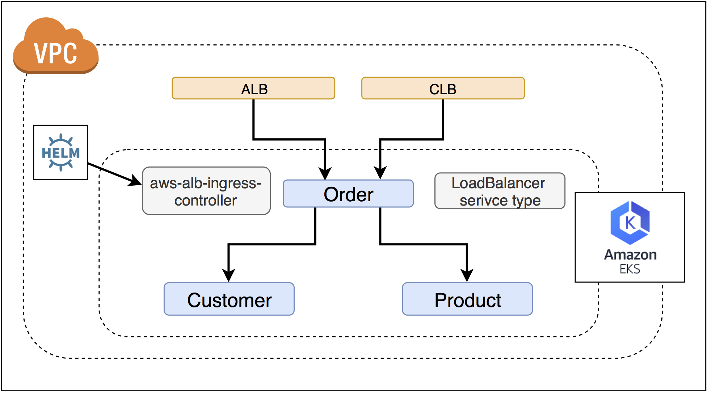

# Lab 2 - Running Services in Amazon EKS



In this lab, we are deploying our microservices in Amazon EKS and expose the `Order` service as `CLB` or `ALB`.


## Create cluster with eksctl

```bash
# download and install eksctl from eksc tl.io 
$ curl --silent --location "https://github.com/weaveworks/eksctl/releases/download/latest_release/eksctl_$(uname -s)_amd64.tar.gz" | tar xz -C /tmp
$ sudo mv /tmp/eksctl /usr/local/bin
$ eksctl version 
[ℹ]  version.Info{BuiltAt:"", GitCommit:"", GitTag:"0.1.32"}
# create Amazon EKS cluster with eksctl
$ export AWS_REGION=ap-northeast-1
$ eksctl create cluster --name myeks
# (this may take up to 15min)
# get the nodes
$ kubectl get no
NAME                                                STATUS   ROLES    AGE     VERSION
ip-192-168-5-238.ap-northeast-1.compute.internal    Ready    <none>   3m32s   v1.12.7
ip-192-168-92-162.ap-northeast-1.compute.internal   Ready    <none>   3m29s   v1.12.7
```


create k8s services

```bash
# deploy the services in Amazon EKS
$ bash 02-deploy_v1.sh
# check the ELB dns name of order service
$ kubectl  get svc/order
NAME    TYPE           CLUSTER-IP     EXTERNAL-IP                                                                   PORT(S)        AGE
order   LoadBalancer   10.100.50.51   a98c44c72809711e995940a063a6e1fe-571914798.ap-northeast-1.elb.amazonaws.com   80:32508/TCP   14m
# curl the order service ELB endpoint
$ curl a98c44c72809711e995940a063a6e1fe-571914798.ap-northeast-1.elb.amazonaws.com
{"service":"Order", "version":"1.0"}
{"service":"Customer","version":"1.0"}
{"service":"Product","version":"1.0"}
```
Please note we just exposed the `Order` service with `LoadBalancer` service type, which is 
`Classic Load Balancer`. Now let's create an **AWS ALB Ingress** for it.

As we are going to install `aws-alb-ingress-controller` with `Helm`, let's install `Helm` first.


## Install Helm 

You may follow the AWS document about [Using Helm with Amazon EKS](https://docs.aws.amazon.com/eks/latest/userguide/helm.html) 
or just follow the following steps:

```bash
# install helm cli 
$ curl -L https://git.io/get_helm.sh | bash
# create 'tiller' namespace
$ kubectl create namespace tiller
# open a new terminal and run tiller client mode
$ export TILLER_NAMESPACE=tiller
$ tiller -listen=localhost:44134 -storage=secret -logtostderr
# open a new terminal
$ export HELM_HOST=:44134
$ helm init --client-only
$ helm repo update
```

## put extra role policy on the eks nodegroup

Before we deploy the `aws-alb-ingress-controller`, we need to put extra IAM policy for the EKS nodegroup and enable EC2 IAM role 
to provision ALB and relevant resources for us.


```bash
# <EKS_NODEGROUP_ROLE_NAME> is your EKS nodegroup EC2 instance role name
$ aws iam put-role-policy --role-name {EKS_NODEGROUP_ROLE_NAME}  --policy-name alb-ingress-extra --policy-document file://k8s/alb-ingress/iam-policy.json
```


## Install aws-alb-ingress-controller with Helm

```bash
# open a new terminal
$ export HELM_HOST=:44134
$ helm repo add incubator http://storage.googleapis.com/kubernetes-charts-incubator
$ helm repo update
# install aws-alb-ingress-controller, make sure you specify correct clusterName
$ helm install incubator/aws-alb-ingress-controller \
--set clusterName=eksdemo \
--set autoDiscoverAwsRegion=true \
--set autoDiscoverAwsVpcID=true
```

Let's make sure the `alb-ingress-controller` is running

```bash
$ kubectl get po -l app.kubernetes.io/name=aws-alb-ingress-controller
NAME                                                       READY   STATUS    RESTARTS   AGE
wise-whippet-aws-alb-ingress-controller-766ddcdc4f-q7dhx   1/1     Running   0          6m34s
```
or just

```bash
$ kubectl get po | grep aws-alb-ingress
wise-whippet-aws-alb-ingress-controller-766ddcdc4f-q7dhx   1/1     Running   0          7m18s
```


Let's deploy the ingress object 


```bash
$ kubectl apply -f k8s/alb-ingress/ingress-public.yaml 
ingress.extensions/demoserver created
# get the ing 
$ kubectl get ing
NAME         HOSTS   ADDRESS   PORTS   AGE
demoserver   *                 80      34s
# check the aws-ingress-controller-log
$ kubectl logs -f $(kubectl get po  | egrep -o [a-zA-Z0-9-]+alb-ingress[a-zA-Z0-9-]+)
```
you should see some logs like

```
I0529 06:57:28.056049       1 loadbalancer.go:185] default/demoserver: creating LoadBalancer 6fa5d906-default-demoserve-f046
I0529 06:57:28.884829       1 loadbalancer.go:201] default/demoserver: LoadBalancer 6fa5d906-default-demoserve-f046 created, ARN: arn:aws:elasticloadbalancing:ap-northeast-1:903779448426:loadbalancer/app/6fa5d906-default-demoserve-f046/9f2118462cbaed2f
I0529 06:57:29.023790       1 targetgroup.go:119] default/demoserver: creating target group 6fa5d906-7882b03726b75dad275
I0529 06:57:29.209351       1 targetgroup.go:138] default/demoserver: target group 6fa5d906-7882b03726b75dad275 created: arn:aws:elasticloadbalancing:ap-northeast-1:903779448426:targetgroup/6fa5d906-7882b03726b75dad275/33458d2691a216a8
```

describe the ingress object

```
ng/demoserver
Name:             demoserver
Namespace:        default
Address:          6fa5d906-default-demoserve-f046-287152812.ap-northeast-1.elb.amazonaws.com
Default backend:  default-http-backend:80 (<none>)
Rules:
  Host  Path  Backends
  ----  ----  --------
  *     
        /   order:80 (<none>)
Annotations:
  alb.ingress.kubernetes.io/scheme:                  internet-facing
  alb.ingress.kubernetes.io/tags:                    Environment=dev,Team=test
  alb.ingress.kubernetes.io/target-type:             ip
  kubectl.kubernetes.io/last-applied-configuration:  {"apiVersion":"extensions/v1beta1","kind":"Ingress","metadata":{"annotations":{"alb.ingress.kubernetes.io/scheme":"internet-facing","alb.ingress.kubernetes.io/tags":"Environment=dev,Team=test","alb.ingress.kubernetes.io/target-type":"ip","kubernetes.io/ingress.class":"alb"},"name":"demoserver","namespace":"default"},"spec":{"rules":[{"http":{"paths":[{"backend":{"serviceName":"order","servicePort":80},"path":"/"}]}}]}}

  kubernetes.io/ingress.class:  alb
Events:
  Type    Reason  Age   From                    Message
  ----    ------  ----  ----                    -------
  Normal  CREATE  5m9s  alb-ingress-controller  LoadBalancer 6fa5d906-default-demoserve-f046 created, ARN: arn:aws:elasticloadbalancing:ap-northeast-1:903779448426:loadbalancer/app/6fa5d906-default-demoserve-f046/9f2118462cbaed2f
  Normal  CREATE  5m8s  alb-ingress-controller  rule 1 created with conditions [{    Field: "path-pattern",    Values: ["/"]  }]
  ```
  
  curl the ALB endpoint
  
  ```
  $ curl -s 6fa5d906-default-demoserve-f046-287152812.ap-northeast-1.elb.amazonaws.com
{"service":"Order", "version":"1.0"}
{"service":"Customer","version":"1.0"}
{"service":"Product","version":"1.0"}
```

Please note now we have both `CLB` and `ALB` for the `Order` service.

```bash
# get the CLB hostname
$ kubectl get svc/order -o jsonpath='{@.status.loadBalancer.ingress[0].hostname}'
ab1b609de809611e9954f0e9b12d942b-797135816.ap-northeast-1.elb.amazonaws.com
# try curl on it
$ curl -s ab1b609de809611e9954f0e9b12d942b-797135816.ap-northeast-1.elb.amazonaws.com
{"service":"Order", "version":"1.0"}
{"service":"Customer","version":"1.0"}
{"service":"Product","version":"1.0"}

# get the ALB hostname
kubectl get ing/demoserver -o jsonpath='{@.status.loadBalancer.ingress[0].hostname}'
6fa5d906-default-demoserve-f046-287152812.ap-northeast-1.elb.amazonaws.com
# try curl on it
$ curl -s 6fa5d906-default-demoserve-f046-287152812.ap-northeast-1.elb.amazonaws.com{"service":"Order", "version":"1.0"}
{"service":"Customer","version":"1.0"}
{"service":"Product","version":"1.0"}
```


